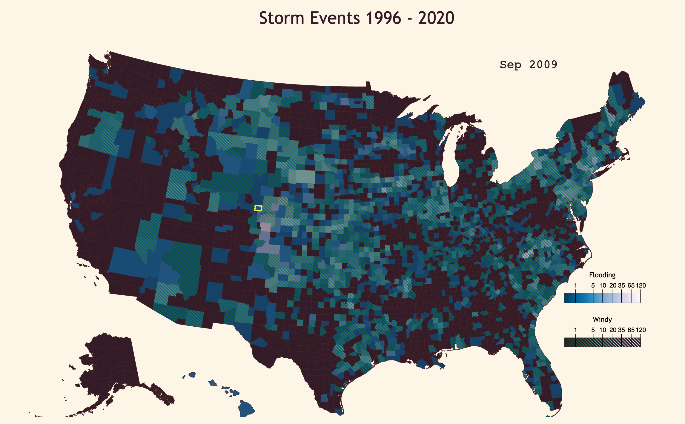
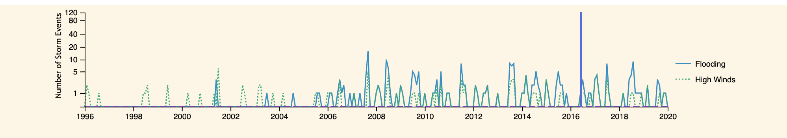

# StormEventsViz
Visualizing data from the National Weather Service using D3.

The data visualized are from the [Storm Events Database](https://www.ncdc.noaa.gov/stormevents/ftp.jsp), significantly simplified and reduced to only the data since 1996. Before that time, not much was reported that fell into my categories of interest: Storm types with flooding or high winds. 

### Main Plot

The bulk of the visualization depicts all the counties of the United States. Each county is colored to indicate the number of events in a category for a given month and year. Counties can be selected to be highlighted, and display its data over time in the secondary plot.

The plot automatically advances through time, but a specific time can be selected for display in the secondary plot.

### Secondary Plot

The secondary plot displays the count of storms in a specific county over time. The vertical blue line shows the time displayed in the main plot. 

Clicking/Dragging on the plot will set the time displayed in the main plot, and stop the automatic advancement through time. It can be resumed by hitting the "Play" button above the secondary plot.

## Data
Data is not included in this repository, but is freely available from NOAA, and an example script to download the data is found in `util/`, as well as file lists with the url to each file in 3 categories:  
1. Storm Details (1.26 GB).  
2. Storm Fatalities (1.5 MB).  
3. Storm Locations (83.1 MB).  

The database can be found [HERE](https://www.ncdc.noaa.gov/stormevents/ftp.jsp) and the .json file used in the visualization is available [HERE](https://datahub.io/tlhm/countyeventsmin-rare-mole-24/r/0.json).

### Data Processing
The analysis thus far has been fairly rudimentary. The script used to create the .json file from the database files is found in the `util/` folder.

The script is based solely on the Storm Details files, and sums the occurrances of storms in specified categories for each county and each month.

All occurrances were required to have had at least one reported injury or death, or alternatively some property or crop damage reported. This was meant to weed out minor storms, but it's very possible that as time went on, smaller sums of damage were reported, diminishing the effectiveness of this filter.

The categories were based on the Event Type:  
1. **Flooding**: Coastal Flood, Flash Flood, Flood, Lakeshore Flood, Storm Surge/Tide, Debris Flow	
2. **Windy**: Cold/Wind Chill, Extreme Cold/Wind Chill, High Wind, Marine High Wind, Marine Strong Wind, Marine Thunderstorm Wind, Strong Wind, Thunderstorm Wind, Dust Storm, Ice Storm, Marine Thunderstorm Wind, Storm Surge/Tide, Thunderstorm Wind, Tropical Storm, Winter Storm, Tornado, Hurricane (Typhoon),Dust Devil, Waterspout

The windy types were also required to have a reported magnitude of wind.

The script also calculates an "icy" category that was not used for this visualization.

## Dev

For anyone interested in modifying the project or running it locally, you will need `npm` installed on your machine. Then, all necessary packages can be installed with a simple `npm install` in the project directory.

Webpack and Babel were used for development, and the scripts rely on TopoJSON and D3.

### Possible Improvements

A number of the scripts could be made slightly more modular and reusable, which could be handy to visualizing similar data in the future. This is particularly true of the main map.

For speed, a single-layed map is much easier on the rendering. Multiple types of data could be delegated to single-color gradients, and each county colored as an addition (or other blending) or the colors.

Alternatively, a Canvas representation might be faster on the rendering as well. A WebGL rendering could be a bit fancier, but lies outside the realms of D3.

The data loaded are pretty bulky, so another improvement would be splitting that data into smaller files, and loading them in sequence and expanding the viewable time range as we load more data.

Finally, the data base is rich, and this was only a very surface level glance at its contents. There may be much more interesting visualizations to be made.